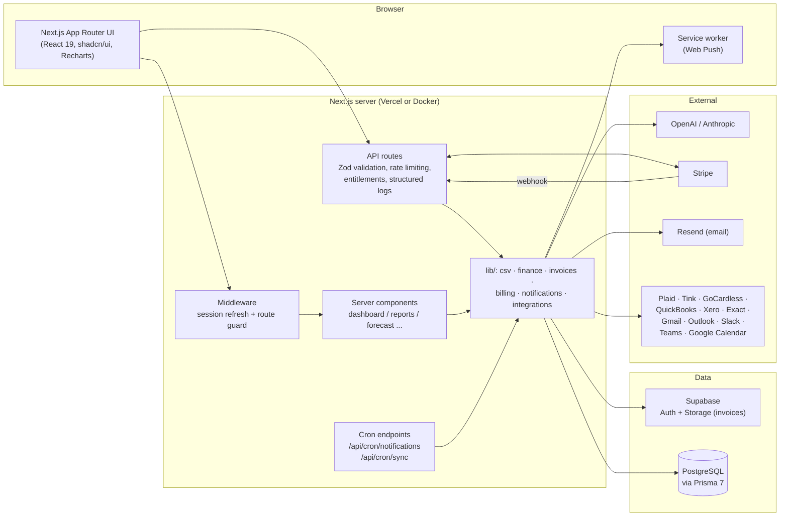

# Ballast — AI-powered clarity on your money

A production-quality finance dashboard built with Next.js 15, Supabase, Prisma and
Groq/OpenAI/Anthropic, shipping as two editions from one codebase: **Ballast Business**
for companies and **Ballast Personal** for individuals. Live at
<https://app.ballastmoney.com>.

> The npm package name (`ai-finance-copilot`) and the GitHub repository name are unchanged;
> only the product name is Ballast.

## The two editions

A visitor picks a path on the landing page ("For my business" / "For myself"). The choice
travels as `?for=business|personal`, into Supabase user metadata at signup so it survives
the email-confirmation round trip, and finally into the `type` of the workspace created on
first login. Every workspace that existed before this shipped is `BUSINESS`, and the
Business edition is unchanged — nothing was taken away from it.

A workspace's type, not the account, decides the edition, so one account can own a company
workspace and a personal one and switch between them; **Create workspace** in the switcher
asks which type to make.

| | Business | Personal |
| --- | --- | --- |
| Shared core | Transactions, CSV import, categories & rules, bank connections, cash-flow forecast, copilot, reports, notifications, exports, billing | same |
| Invoices (AI extraction, VAT, payable/receivable, reminders) | ✅ | — |
| Vendors & customers, AR/AP aging | ✅ | — |
| Team sharing: members, roles, invitations, seats | ✅ | — (single-user by design) |
| Accounting integrations (QuickBooks, Xero, Exact) | ✅ | — |
| Monthly budgets per category, with rollover | — | ✅ |
| Savings goals with a projected completion date | — | ✅ |
| Subscription detection and cost insights | — | ✅ |
| Dashboard | Revenue/expense/net KPIs, AR/AP | Spending vs budget, cash on hand, upcoming bills, goals, subscriptions |
| Copilot & help agent | CFO framing: margins, suppliers, hiring | Money-coach framing: "can I afford this?", "where did my money go?" |
| Plans | Free, Pro €19, Business €49, Enterprise | Free, Plus €4.99, Premium €8.99 |

The matrix lives in `src/lib/workspace/editions.ts` and is enforced server-side, not by
hiding links: the workspace context intersects a member's permissions with the edition's
(so `requireWorkspace("edit_invoices")` already 403s in a personal workspace), each
edition-specific page and API route rejects a typed-in URL on its own
(`/budgets` 404s in a business workspace), and the sidebar filters itself with the same
predicate. `src/lib/branding.ts` holds the per-edition naming and copy.

## Features

- **Authentication** — email/password sign up with email confirmation, sign in, forgot/reset
  password, plus optional passkeys (WebAuthn) for Face ID / fingerprint / Windows Hello
  via Supabase Auth (enable under Authentication → Passkeys; password always remains) (Supabase Auth, PKCE flow, session refresh middleware)
- **Dashboard** — current-month income/expense cards with month-over-month trends, total
  balance and savings rate, monthly cashflow chart (income/expense bars + net line),
  spending-by-category donut, largest expenses, cash-balance history (Recharts)
- **Bank statement import (CSV, Excel, PDF, MT940)** — drag & drop upload; the format is
  detected from the file's own bytes, then CSV/TSV, `.xlsx`/`.xls`, PDF text layers and
  MT940/SWIFT files all funnel into one representation. Automatic detection of delimiter
  (comma/semicolon/tab/pipe), encoding (UTF-8/UTF-16/Windows-1252), US vs European number
  formats and date layouts; automatic column detection (date, description, amount or
  debit/credit pair, balance, counterparty) with a correctable mapping preview; duplicate
  rows are skipped across imports and every import is tracked as a batch that can be undone
- **Transactions** — server-side search (description/counterparty), filters (date range,
  category, type, amount range, import batch), pagination, inline category editing,
  multi-select bulk actions (set category, delete), manual add with validated forms
- **Categories** — per-user category set seeded on first login, user-defined categories with
  colors, and auto-categorization rules (description/counterparty pattern matching) applied
  during import
- **Invoice management** — drag & drop upload of PDF invoices, receipts and photos
  (JPG/PNG/WebP) stored in a private Supabase Storage bucket under a per-user path and served
  through short-lived signed URLs. AI extraction pulls vendor, invoice number, dates,
  currency, VAT, line items and totals (vision for images, text layer via `unpdf` for PDFs;
  strict-JSON prompt validated with Zod, one retry, graceful "needs review" fallback for
  scanned PDFs or failures). Every upload lands in an editable review form before saving.
  The `/invoices` dashboard shows status badges (draft/unpaid/paid/overdue), filters,
  outstanding/overdue/paid-this-month totals, due-soon reminders, a detail view with inline
  document preview and line items, quick mark paid/unpaid, and suggested transaction matches
  (amount + date + vendor similarity) with manual link/unlink — linking marks the invoice
  paid and the link shows on both sides.
- **Cash flow forecasting** — a deterministic forecast engine (`/forecast`) that combines
  recurring-payment scheduling, a linear spending trend and user-defined assumptions into
  30-day, 90-day and 12-month projections with an ~80% confidence band. Computes cash
  runway, net/gross burn rate, recurring income/expense totals and upcoming bills. Users can
  add what-if assumptions (one-off amounts on a date, monthly recurring adjustments with
  optional start/end dates, compounding % growth per month) and toggle them on/off — the
  forecast recomputes on every change. A streamed "Explain this forecast" action asks the AI
  for drivers, risks and recommendations.
- **AI Copilot** — a streaming financial assistant grounded in a rich snapshot of your data:
  12-month income/expense/net summaries, spending by category, top counterparties/suppliers,
  largest expenses, recurring payment patterns, the full cash forecast (runway, burn,
  projections, assumptions), and statistically unusual transactions (z-score vs category
  norms). Multiple conversations with auto-generated titles, rename/delete, markdown answers
  (tables, lists), data-driven suggested questions, and a stop-generation button. Works with
  both OpenAI and Anthropic through a shared streaming provider abstraction.
- **Executive reports** — a `/reports` area with a period selector (this month, last month,
  quarter, YTD, last 12 months, custom range) driving every figure: revenue, expenses, net
  profit and margin KPIs with period-over-period deltas, cash at period end, accounts
  receivable/payable, monthly trend combo chart, year-over-year comparison, income and
  expense category breakdowns, top vendors and customers, and AR/AP aging (current / 1–30 /
  31–60 / 60+ days). Invoices carry a payable/receivable direction toggle: AR is the sum of
  unpaid invoices you issued, AP the unpaid bills you owe. One-click exports: a professional
  PDF report (server-rendered with `pdf-lib` — no headless browser needed), a multi-sheet
  Excel workbook via `exceljs` (KPIs, monthly trends, transactions, categories, top
  vendors/customers) and CSV (transactions or monthly summary).
- **Notifications** — an in-app notification center (bell in the header with unread badge,
  mark read / mark all read) as the always-available channel, plus optional email (Resend)
  and Web Push (VAPID service worker) channels. AI-generated daily/weekly/monthly digests
  (what happened, notable changes, upcoming bills, forecast outlook — with a deterministic
  fallback when no AI key is set), large-transaction alerts (configurable threshold or
  statistically unusual expenses, evaluated immediately on create/import), low-cash warnings
  (balance below a configurable floor now, or projected to drop below it within N days using
  the forecast engine), and daily invoice reminders. Per-type and per-channel toggles live in
  Settings. An hourly Vercel Cron hits a CRON_SECRET-protected endpoint that evaluates all
  users idempotently via last-sent timestamps.
- **SaaS billing** — two tier sets in a single source of truth
  (`src/lib/billing/plans.ts`): Business (Free, Pro €19, Business €49, Enterprise) and
  Personal (Free, Plus €4.99, Premium €8.99), each with per-plan limits (bank connections,
  CSV imports and rows per import, AI messages, invoice extractions, exports, forecast
  assumptions). A workspace is only ever shown and sold the tiers of its own edition.
  Stripe Checkout for upgrades, a webhook keeping the local subscription in sync, the Stripe Billing Portal
  for payment methods/cancellation, and a `/billing` page with the current plan, usage
  meters, plan matrix, invoice history and a referral program (share a link, earn 30 days
  per converted referral). Every new account gets a card-free 14-day trial of its
  edition's middle tier (Pro for Business, Plus for Personal), which is also what the
  referral credit extends.
  Limits are enforced server-side in the API routes (friendly 402 responses with upgrade
  hints) and reflected in the UI (disabled export buttons, locked assumptions card, copilot
  quota banner). Without Stripe keys everything still works on Free/trial.
- **Admin & analytics** — an `isAdmin`-guarded `/admin` dashboard with user list
  (plan/usage/joined), KPI cards (total users, active subscriptions, MRR estimate, signups,
  AI usage) and charts driven by a lightweight internal `AnalyticsEvent` table (signup,
  import, AI message, export, upgrade — no third-party trackers).
- **Integrations** (Business plan; banks on every Personal plan) — an `/integrations` page connecting banks (Plaid via
  Link, Tink via OAuth, GoCardless Bank Account Data via requisitions — transactions flow
  through the same dedupe/categorization pipeline as CSV imports), accounting software
  (QuickBooks, Xero, Exact Online — bills and invoices upserted into the invoice module),
  mailboxes (Gmail, Outlook — PDF invoice attachments ingested into the extraction/review
  pipeline), chat (Slack, Teams — finance alerts and digests as extra notification
  channels) and Google Calendar (opt-in events for upcoming bills). OAuth tokens are
  encrypted at rest (AES-256-GCM), refreshed automatically, and every connection shows its
  status, last sync and last error with connect/disconnect/sync-now controls. An hourly
  cron runs due syncs with per-connection error isolation and failure backoff; providers
  without credentials simply show as "Not configured" with the env vars they need. A
  personal workspace sees only the tiles that make sense for one person's money — banks,
  calendar, chat — and its plan caps bank connections (1 on Free, unlimited from Plus),
  enforced at the connect route rather than after the OAuth round trip.
- **Teams & shared workspaces** (Business) — every account gets a workspace, and Business+
  plans can invite more people into it: members sign in with their own accounts and share
  the workspace's transactions, invoices, forecasts and copilot. Roles
  (owner/admin/member/viewer) with per-member permission overrides, hashed single-use email
  invitations (7-day expiry), a workspace switcher, seat limits from the plan, and an audit
  log of member/billing/data changes. See [Teams, roles & permissions](#teams-roles--permissions).
- **Budgets** (Personal) — a monthly limit per category with progress bars, over/under
  status and an optional rollover that carries an underspend (or overspend) into the next
  month instead of restarting from the limit. `/budgets` for the full month, plus a
  dashboard widget showing the categories closest to their limit.
- **Savings goals** (Personal) — named goals with a target amount and optional target date,
  contributions tracked individually (hand-entered or recognised from a linked category or
  account), and a projected completion date from the recent saving rate — so a goal reads
  "on track", "behind" or "needs €180/mo to make it".
- **Subscriptions** (Personal) — recurring charges detected from real transactions by the
  same engine the forecast uses, with total monthly cost, the next charge date per
  subscription, flags for price increases against the previous charge, and flags for ones
  that look unused (nothing but the charge itself for months).
- **Profile & Settings** — display name, preferred currency, AI provider choice, theme
  (light/dark/system) and password change
- **UI** — responsive layout, dark mode, toast notifications, loading skeletons, error
  boundaries, shadcn/ui component library on Tailwind CSS v4
- **Installable app (PWA)** — web manifest, icons, service worker, and install prompt so
  Ballast can be added to phone home screens and the Windows Start menu. Optional MSIX /
  WebView2 packaging notes in **[WINDOWS_APP.md](WINDOWS_APP.md)** (closest practical path
  to a UWP-style mobile/desktop app without a C# rewrite)

## Tech stack

| Layer      | Technology                                        |
| ---------- | ------------------------------------------------- |
| Framework  | Next.js 15 (App Router, React 19, TypeScript)     |
| Styling    | Tailwind CSS v4, shadcn/ui, next-themes           |
| Auth       | Supabase Auth (`@supabase/ssr`)                   |
| Database   | Supabase PostgreSQL via Prisma 7 (`adapter-pg`)   |
| Forms      | React Hook Form + Zod v4                          |
| Charts     | Recharts                                          |
| AI         | OpenAI / Anthropic via a small provider interface |
| Deployment | Vercel                                            |

## Project structure

```
├── prisma/
│   ├── schema.prisma          # Workspace (+type), Profile, Category, CategoryRule,
│   │                          # ImportBatch, Transaction, Budget, SavingsGoal,
│   │                          # SavingsContribution, Conversation, ChatMessage,
│   │                          # Assumption, Invoice, InvoiceLineItem models
│   ├── migrations/            # SQL migrations (apply with npm run db:deploy)
│   └── seed.ts                # Demo data seeder
├── prisma.config.ts           # Prisma 7 CLI config (datasource, migrations, seed)
├── tests/                     # Vitest suite for the pure lib logic
├── .github/workflows/ci.yml   # Lint + typecheck + test + build pipeline
├── Dockerfile                 # Multi-stage image (Next.js standalone)
├── docker-compose.yml         # App + Postgres for self-hosting
├── src/
│   ├── app/
│   │   ├── (auth)/            # login, signup, forgot-password, reset-password
│   │   ├── (dashboard)/       # dashboard, transactions, import, categories,
│   │   │                      # invoices (+detail), forecast, copilot, profile,
│   │   │                      # settings, budgets, goals, subscriptions
│   │   ├── api/               # transactions (+bulk), categories, rules,
│   │   │                      # import (parse/commit/batches), profile, copilot,
│   │   │                      # conversations, forecast (+explain), assumptions,
│   │   │                      # invoices (upload/document/matches/link/reminders)
│   │   ├── auth/              # Supabase callback + confirm handlers
│   │   ├── error.tsx          # global error boundary
│   │   └── not-found.tsx
│   ├── components/
│   │   ├── ui/                # shadcn/ui primitives (button, card, dialog, ...)
│   │   ├── auth/              # auth forms
│   │   ├── dashboard/         # sidebar, header, charts, stat cards
│   │   ├── transactions/      # table, toolbar (search/filters), add dialog
│   │   ├── import/            # dropzone, mapping wizard, import history
│   │   ├── categories/        # category + auto-categorization rule managers
│   │   ├── invoices/          # upload dialog, table, review form, document
│   │   │                      # preview, transaction matching
│   │   ├── forecast/          # forecast chart, assumptions manager, bills,
│   │   │                      # recurring tables, AI explanation
│   │   ├── copilot/           # chat interface
│   │   ├── profile/ settings/ # profile & settings forms
│   │   └── theme-*.tsx        # dark mode provider/toggle
│   ├── lib/
│   │   ├── ai/                # OpenAI/Anthropic streaming abstraction, financial
│   │   │                      # context snapshot, prompts, suggested questions
│   │   ├── csv/               # CSV decoding, delimiter/format/column detection,
│   │   │                      # row normalization (shared server + client)
│   │   ├── finance/           # shared recurrence detection + forecast engine
│   │   ├── invoices/          # AI extraction, PDF text, storage, matching,
│   │   │                      # reminders, serialization (Business edition)
│   │   ├── personal/          # budget math, goal projection, subscription
│   │   │                      # detection (Personal edition)
│   │   ├── supabase/          # browser/server/middleware clients
│   │   ├── validations/       # Zod schemas
│   │   ├── workspace/         # workspace context, permissions, edition matrix
│   │   ├── categories.ts      # default category seeding + rule matching
│   │   ├── data.ts            # server-side data access & aggregation
│   │   ├── env.ts             # validated environment variables
│   │   ├── prisma.ts          # Prisma client singleton
│   │   └── utils.ts
│   ├── generated/prisma/      # generated Prisma client (git-ignored)
│   └── middleware.ts          # session refresh + route protection
└── .env.example
```

## Getting started

### 1. Install dependencies

```bash
npm install
```

### 2. Create a Supabase project

1. Create a project at [supabase.com](https://supabase.com).
2. In **Project Settings → API**, copy the project URL and anon key.
3. In **Project Settings → Database**, copy the pooled (port 6543) and direct (port 5432)
   connection strings.
4. Optional: in **Authentication → URL Configuration**, set the site URL and add
   `http://localhost:3000/auth/callback` to the redirect allow list.

### 3. Configure environment variables

```bash
cp .env.example .env
```

Fill in the Supabase values and at least one AI provider key (`OPENAI_API_KEY` or
`ANTHROPIC_API_KEY`).

### 4. Create the database schema

```bash
npm run db:deploy      # applies prisma/migrations (or: npm run db:push)
```

### 5. Create the invoice storage bucket

Invoice documents live in a **private** Supabase Storage bucket named `invoices`, with
files under a per-user prefix (`<userId>/<invoiceId>/<filename>`).

**Option A — dashboard**

1. **Storage → New bucket** — name it `invoices`, keep **Public bucket** off, set a
   **10 MB** file size limit, and allowed MIME types `application/pdf`, `image/jpeg`,
   `image/png`, `image/webp`.
2. **SQL Editor** — run the policy SQL in Option B (step 2 only).

**Option B — SQL Editor (idempotent; preferred for reprovisioning)**

```sql
insert into storage.buckets (id, name, public, file_size_limit, allowed_mime_types)
values (
  'invoices',
  'invoices',
  false,
  10485760,
  array['application/pdf', 'image/jpeg', 'image/png', 'image/webp']
)
on conflict (id) do update set
  public = excluded.public,
  file_size_limit = excluded.file_size_limit,
  allowed_mime_types = excluded.allowed_mime_types;

drop policy if exists "Users manage own invoice files" on storage.objects;
create policy "Users manage own invoice files"
on storage.objects for all to authenticated
using (
  bucket_id = 'invoices'
  and (storage.foldername(name))[1] = auth.uid()::text
)
with check (
  bucket_id = 'invoices'
  and (storage.foldername(name))[1] = auth.uid()::text
);
```

Verify with:

```sql
select id, public, file_size_limit, allowed_mime_types
from storage.buckets where id = 'invoices';

select policyname, cmd, roles::text, qual::text, with_check::text
from pg_policies
where schemaname = 'storage' and tablename = 'objects'
  and policyname = 'Users manage own invoice files';
```

The app uploads with the user's own session (no service key needed) and views/downloads
go through short-lived signed URLs from `GET /api/invoices/[id]/document`. Upload failures
that mean the bucket is missing return a distinct 502 message (see
`src/lib/invoices/storage.ts` and `POST /api/invoices/upload`). `GET /api/health` reports
`storage: "up"|"down"` for this bucket — or `"not_applicable"` when `DATABASE_URL` points
at a non-Supabase Postgres, which cannot be asked about a Supabase catalog.

### 5b. Create the avatar storage bucket

Profile photos live in a **public** Supabase Storage bucket named `avatars`, with files
under a per-user prefix (`<userId>/avatar.{jpg|png|webp}`). The public URL is stored on
`profiles.avatar_url` and rendered in the header without signed URLs. Uploads/deletes are
still restricted by RLS to the authenticated user's own folder.

**Option A — dashboard**

1. **Storage → New bucket** — name it `avatars`, turn **Public bucket** on, set a
   **5 MB** file size limit, and allowed MIME types `image/jpeg`, `image/png`,
   `image/webp`.
2. **SQL Editor** — run the policy SQL in Option B (policies only), or paste the full
   file `ops/storage/avatars-bucket.sql`.

**Option B — SQL Editor (idempotent; preferred)**

```sql
insert into storage.buckets (id, name, public, file_size_limit, allowed_mime_types)
values (
  'avatars',
  'avatars',
  true,
  5242880,
  array['image/jpeg', 'image/png', 'image/webp']
)
on conflict (id) do update set
  public = excluded.public,
  file_size_limit = excluded.file_size_limit,
  allowed_mime_types = excluded.allowed_mime_types;

drop policy if exists "Users manage own avatar files" on storage.objects;
create policy "Users manage own avatar files"
on storage.objects for all to authenticated
using (
  bucket_id = 'avatars'
  and (storage.foldername(name))[1] = auth.uid()::text
)
with check (
  bucket_id = 'avatars'
  and (storage.foldername(name))[1] = auth.uid()::text
);

drop policy if exists "Public read avatars" on storage.objects;
create policy "Public read avatars"
on storage.objects for select to public
using (bucket_id = 'avatars');
```

The same SQL is checked in at [`ops/storage/avatars-bucket.sql`](ops/storage/avatars-bucket.sql).
Apply it in the Supabase SQL Editor for each environment before relying on avatar upload
in production (`POST` / `DELETE` `/api/profile/avatar`).

### 6. Run the app

```bash
npm run dev
```

Open [http://localhost:3000](http://localhost:3000), create an account (confirm the email),
and start adding transactions.

### Optional: seed demo data

After signing up, grab your user id (Supabase dashboard → Authentication → Users) and run:

```bash
npm run db:seed -- <supabase-user-id> <email>
```

### Optional: notification channels

In-app notifications (the bell in the header) work out of the box. Email and push are
enabled by env vars — when they are missing, those sends are logged and skipped.

**Email (Resend)** — see [Email delivery (Resend)](#email-delivery-resend) below.

**Web Push (VAPID)** — generate a key pair once and put it in the env:

```bash
npx web-push generate-vapid-keys
```

```bash
NEXT_PUBLIC_VAPID_PUBLIC_KEY="<publicKey>"
VAPID_PRIVATE_KEY="<privateKey>"
VAPID_SUBJECT="mailto:you@yourdomain.com"
```

Then enable the push channel in **Settings → Notifications** and click
*Enable on this device* (registers `public/sw.js` and stores the browser's subscription).

**Scheduling** — summaries and recurring alerts are evaluated by
`GET /api/cron/notifications`, protected by a bearer token:

```bash
CRON_SECRET="<any long random string>"
```

In production, Vercel Cron drives it hourly via `vercel.json` (Vercel automatically sends
`Authorization: Bearer $CRON_SECRET` for cron invocations). Locally you can trigger a run
with:

```bash
curl -H "Authorization: Bearer $CRON_SECRET" http://localhost:3000/api/cron/notifications
```

### Optional: billing (Stripe)

Without Stripe keys the app runs fully on the Free plan (every new account still gets the
local 14-day Pro trial) and `/billing` shows a "billing not configured" notice. To enable
paid plans:

1. **Create the products/prices** — in the [Stripe dashboard](https://dashboard.stripe.com)
   create four products, each with a monthly recurring price matching
   `src/lib/billing/plans.ts` (or adjust the file): *Ballast Pro* (€19) and
   *Ballast Business* (€49) for the Business edition, *Ballast Plus* (€4.99) and
   *Ballast Premium* (€8.99) for the Personal edition. Copy the four `price_...` ids.
   A workspace is only ever offered the tiers of its own edition, so if you ship one
   edition first you can leave the other pair blank — upgrades are disabled there and
   nowhere else.
2. **Configure the webhook** — add an endpoint pointing at
   `https://yourapp.vercel.app/api/webhooks/stripe` subscribed to:
   `checkout.session.completed`, `customer.subscription.created`,
   `customer.subscription.updated`, `customer.subscription.deleted`, `invoice.paid`,
   `invoice.payment_failed`. Copy its signing secret. (Locally, use
   `stripe listen --forward-to localhost:3000/api/webhooks/stripe`.)
3. **Enable the Billing Portal** — in **Settings → Billing → Customer portal**, activate the
   portal and allow plan switching/cancellation. The app's *Manage billing* button opens it.
4. **Set the env vars**:

```bash
STRIPE_SECRET_KEY="sk_live_..."        # or sk_test_...
STRIPE_WEBHOOK_SECRET="whsec_..."
STRIPE_PRICE_PRO="price_..."               # Business edition, EUR 19/mo
STRIPE_PRICE_BUSINESS="price_..."          # Business edition, EUR 49/mo
STRIPE_PRICE_PERSONAL_PLUS="price_..."     # Personal edition, EUR 4.99/mo
STRIPE_PRICE_PERSONAL_PREMIUM="price_..."  # Personal edition, EUR 8.99/mo
```

Enterprise is contact-sales only (no checkout). Upgrades run through Stripe Checkout with a
card-backed trial applied only if the user's local trial is still running.

**Admin access** — the `/admin` dashboard is enabled per user by a manual database flag:

```sql
UPDATE profiles SET is_admin = true WHERE email = 'you@yourdomain.com';
```

### Optional: integrations (Business plan)

The `/integrations` page connects banks (Plaid, Tink, GoCardless), accounting software
(QuickBooks, Xero, Exact Online) and productivity tools (Gmail, Outlook, Slack, Teams,
Google Calendar). Everything is optional: a provider's card shows **Not configured** with
its required env vars until they are set. Two shared prerequisites:

```bash
# Encrypts OAuth tokens at rest (AES-256-GCM). Required for all integrations.
INTEGRATION_ENCRYPTION_KEY="$(openssl rand -hex 32)"
# Only for Gmail/Outlook invoice ingestion (background storage uploads).
SUPABASE_SERVICE_ROLE_KEY="..."
```

For every OAuth provider, register `https://yourapp.vercel.app/api/integrations/<id>/callback`
as the redirect URI (`<id>` = `tink`, `quickbooks`, `xero`, `exact`, `gmail`, `outlook`,
`slack`, `google-calendar`). App registration in brief:

| Provider | Where | Notes |
| --- | --- | --- |
| Plaid | [dashboard.plaid.com](https://dashboard.plaid.com) | Copy client id + secret; `PLAID_ENV=sandbox` to start. Uses Plaid Link, no redirect URI needed. |
| Tink | [console.tink.com](https://console.tink.com) | Create an app, add the redirect URI, set `TINK_MARKET`. |
| GoCardless | [bankaccountdata.gocardless.com](https://bankaccountdata.gocardless.com) | Create *user secrets* (`GOCARDLESS_SECRET_ID`/`_KEY`). Uses requisitions, not OAuth: the connect dialog shows a searchable bank picker per country and creates an end-user agreement sized to the bank (up to 180 days consent, full history). Set `GOCARDLESS_INSTITUTION_ID=SANDBOXFINANCE_SFIN0000` to surface the sandbox bank in the picker. Bank rate limits (as low as 4 calls/account/day) are respected: throttled accounts are skipped and retried after the bank's reset window. |
| QuickBooks | [developer.intuit.com](https://developer.intuit.com) | App with the *Accounting* scope; add the redirect URI. `QUICKBOOKS_ENV=sandbox` for test companies. |
| Xero | [developer.xero.com](https://developer.xero.com) | Web app; scopes `offline_access accounting.transactions.read accounting.contacts.read`. |
| Exact Online | [apps.exactonline.com](https://apps.exactonline.com) | Register an app in your region and set `EXACT_REGION` (e.g. `start.exactonline.nl`). |
| Google (Gmail + Calendar) | [console.cloud.google.com](https://console.cloud.google.com) | One OAuth client for both providers; enable the Gmail and Calendar APIs; scopes `gmail.readonly` and `calendar.events`. |
| Microsoft (Outlook) | [portal.azure.com](https://portal.azure.com) | Entra app registration, delegated `Mail.Read` + `offline_access`; web redirect URI. |
| Slack | [api.slack.com/apps](https://api.slack.com/apps) | App with the `incoming-webhook` scope; the user picks a channel during install. |
| Teams | — | No app needed: paste a channel *incoming webhook* URL on the integrations page. |

How syncing works: Vercel Cron hits `GET /api/cron/sync` hourly (same `CRON_SECRET` bearer
token as notifications). Each connection syncs when its interval has elapsed (6 h for
banks/accounting/email, 24 h for calendar), with per-connection error isolation and
exponential backoff after failures. Bank transactions run through the same dedupe +
auto-categorization pipeline as CSV imports (one undoable import batch per sync); accounting
invoices upsert by `external_ref`; Gmail/Outlook PDF attachments flow through the invoice
extraction pipeline into the review queue; Slack/Teams act as additional notification
channels; Google Calendar events for upcoming bills are opt-in via a toggle on the card.

## Email delivery (Resend)

Email is optional. The app runs fine without it — in-app notifications still work, and
**team invitations always show a copyable link that works on its own**, so you can onboard
a partner with no mail setup at all.

**1. Get an API key.** Sign up at [resend.com](https://resend.com) and create an API key
(`re_...`) under *API Keys*.

**2. Set the two env vars** and restart the server:

```bash
RESEND_API_KEY="re_..."
EMAIL_FROM="Ballast <notifications@send.yourdomain.com>"
NEXT_PUBLIC_APP_URL="https://yourapp.vercel.app"   # used for links inside emails
```

Both are required: with either one missing the app reports `not_configured` and skips the
send rather than pretending it worked.

**3. Verify a sending domain — this is the step people miss.** Resend will not deliver to
arbitrary recipients until you have verified a domain. With the shared
`onboarding@resend.dev` sender you can *only* email the address your Resend account was
registered with; anything else comes back as HTTP 403 ("you can only send testing emails to
your own email address… please verify a domain"). Add your domain under
*Domains → Add domain*, publish the DNS records it gives you, and point `EMAIL_FROM` at it.
Use a dedicated subdomain such as `send.yourdomain.com` (Resend's recommendation): sending
reputation stays isolated from your main domain's mail, and the DNS records don't collide
with an existing mailbox provider on the apex.

**4. Verify what the deployment actually sees.** Guessing whether Vercel really has the
variables is the slowest way to debug this. `GET /api/health` answers it from outside, in an
`email` section: whether each variable is present (booleans only — the key itself is never
reported), the from-address **domain**, and a `configured` flag read straight from
`isEmailConfigured()`, so it cannot disagree with what a real send would do:

```bash
curl -s https://<app>/api/health | jq .email
# { "configured": true, "apiKeyPresent": true, "apiKeyEnvVar": "RESEND_API_KEY",
#   "fromPresent": true, "fromEnvVar": "EMAIL_FROM", "fromValid": true,
#   "fromDomain": "send.yourdomain.com" }
```

`configured: false` with `apiKeyPresent: false` means the variable never reached the running
deployment — check the environment *and* redeploy, since Vercel only applies env changes to
new builds. To also confirm the domain in `EMAIL_FROM` is the one you verified, run the
authenticated probe (`CRON_SECRET` bearer), which calls Resend's domains endpoint:

```bash
curl -H "Authorization: Bearer $CRON_SECRET" "https://<app>/api/health?probe=email" | jq .email
# adds: "keyAuthenticates": true,
#       "domains": [{ "name": "send.yourdomain.com", "status": "verified" }],
#       "fromDomainVerified": true
```

`keyAuthenticates: false` with `probeError: "HTTP 401"` is a bad or revoked key;
`fromDomainVerified: false` is the mismatch behind the 403 in step 3. Email is optional, so
none of this changes the endpoint's HTTP status — it stays informational.

**5. Prove an actual delivery.** Configuration being right is not the same as mail
arriving. `npm run verify:email -- --url https://<app>` runs both checks above and then
triggers the notification cron, reporting `SENT` with Resend's message id — the receipt you
can look up under *Resend → Emails* — or naming exactly which of `not_configured`,
`domainRestricted` or a provider failure happened. Step-by-step, including how to put an
account into a state where a digest is due:
[DEPLOYMENT.md → Verifying notification email in production](DEPLOYMENT.md#verifying-notification-email-in-production).

**How failures surface.** Every send goes through `sendEmail()` in
`src/lib/notifications/email.ts`, which returns `sent`, `not_configured`, or `failed` (with
the provider message, sanitized, and a `domainRestricted` flag for the case above) and logs
it through the structured logger. The invite dialog shows that status next to the link, and
*Settings → Notifications* says plainly when email delivery isn't configured instead of
implying the channel works.

## Scripts

| Script               | Purpose                                  |
| -------------------- | ---------------------------------------- |
| `npm run dev`        | Start the dev server (Turbopack)         |
| `npm run build`      | Production build                         |
| `npm run start`      | Serve the production build               |
| `npm run lint`       | Run ESLint                               |
| `npm run typecheck`  | TypeScript `tsc --noEmit`                |
| `npm test`           | Run the Vitest suite once                |
| `npm run test:watch` | Run Vitest in watch mode                 |
| `npm run verify:email` | Prove a deployment really sends notification email (see [DEPLOYMENT.md](DEPLOYMENT.md#verifying-notification-email-in-production)) |
| `npm run db:push`    | Push the Prisma schema to the database   |
| `npm run db:migrate` | Create/apply a development migration     |
| `npm run db:deploy`  | Apply migrations in production           |
| `npm run db:seed`    | Seed demo transactions for a user        |
| `npm run db:studio`  | Open Prisma Studio                       |

## Architecture



## Environment variables

Every variable is optional unless marked required — features degrade gracefully when their
keys are missing. Full commented reference in [.env.example](.env.example).

| Variable | Required | Used for |
| --- | --- | --- |
| `NEXT_PUBLIC_SUPABASE_URL` | ✅ | Supabase project URL (auth + storage) |
| `NEXT_PUBLIC_SUPABASE_ANON_KEY` | ✅ | Supabase anon key (safe for the client) |
| `DATABASE_URL` | ✅ | Supabase **transaction pooler** (runtime): port **6543**, host `aws-*-<region>.pooler.supabase.com`, user `postgres.<project-ref>`, query `?pgbouncer=true`. Prefer the IPv4 pooler host on Vercel — avoid the direct `db.<ref>.supabase.co` host (IPv6-only on many projects). |
| `DIRECT_URL` | ✅ | Session/direct URL for migrations (port **5432**). On IPv4-only networks use the pooler session port, e.g. `…pooler.supabase.com:5432/postgres`. |
| `NEXT_PUBLIC_APP_URL` | ✅ in prod | Absolute app URL (emails, OAuth redirects, SEO) |
| `NEXT_PUBLIC_ISSUES_URL` | — | GitHub Issues new-issue URL for “Report issue” (falls back to mailto) |
| `NEXT_PUBLIC_SUPPORT_EMAIL` | — | Mailto fallback when `NEXT_PUBLIC_ISSUES_URL` is unset |
| `AI_PROVIDER`, `GROQ_API_KEY`, `GROQ_MODEL`, `GROQ_VISION_MODEL`, `OPENAI_API_KEY`, `OPENAI_MODEL`, `ANTHROPIC_API_KEY`, `ANTHROPIC_MODEL` | — | AI copilot, help agent, forecast explanations, invoice extraction, digests. Model ids are read at request time, so retiring a hosted model is fixed by editing the `*_MODEL` variable — see `/api/health` for the ids in use |
| `RESEND_API_KEY`, `EMAIL_FROM` | — | Email channel for notifications and invites — both required, and Resend needs a verified sending domain (see [Email delivery](#email-delivery-resend)) |
| `NEXT_PUBLIC_VAPID_PUBLIC_KEY`, `VAPID_PRIVATE_KEY`, `VAPID_SUBJECT` | — | Web Push channel |
| `CRON_SECRET` | ✅ in prod | Bearer token for both cron endpoints |
| `UPSTASH_REDIS_REST_URL`, `UPSTASH_REDIS_REST_TOKEN` | — | Shared rate limiting for multi-instance deployments |
| `STRIPE_SECRET_KEY`, `STRIPE_WEBHOOK_SECRET`, `STRIPE_PRICE_PRO`, `STRIPE_PRICE_BUSINESS` | — | Paid plans (Business edition), webhook sync, billing portal |
| `STRIPE_PRICE_PERSONAL_PLUS`, `STRIPE_PRICE_PERSONAL_PREMIUM` | — | Paid plans for the Personal edition (Plus €4.99, Premium €8.99) |
| `INTEGRATION_ENCRYPTION_KEY` | for integrations | AES-256-GCM token encryption (`openssl rand -hex 32`) |
| `SUPABASE_SERVICE_ROLE_KEY` | for mail ingestion | Background storage uploads (Gmail/Outlook) — server-only, never expose |
| `PLAID_*`, `TINK_*`, `GOCARDLESS_*`, `QUICKBOOKS_*`, `XERO_*`, `EXACT_*`, `GOOGLE_*`, `MICROSOFT_*`, `SLACK_*` | per provider | Integration credentials (see the integrations section) |

Only `NEXT_PUBLIC_*` values reach the browser bundle: the Supabase URL + anon key (designed
to be public), the app URL and the VAPID *public* key. Everything else is server-only.

## Teams, roles & permissions

All data (transactions, categories, rules, imports, invoices, forecasts, assumptions,
copilot conversations, budgets, goals, integrations, billing) belongs to a **workspace**,
not to an individual user. Every account owns one, created automatically on first login, so
single-user accounts work exactly as before. Business+ plans can share a workspace with
more people.

This section is about the Business edition. A Personal workspace keeps the same model — it
is a workspace with one member who owns it — but sharing is not part of the product: the
`manage_members` permission is stripped from the edition, the Team UI and its API routes
are gone, and seats are fixed at 1. Everything below therefore applies to Business
workspaces.

**Roles.** Each member has one of four roles:

| Role   | Access                                                                       |
| ------ | ---------------------------------------------------------------------------- |
| Owner  | Everything, always — permission overrides never apply to the owner            |
| Admin  | Everything, including member and billing management                           |
| Member | View + edit data, exports, copilot, forecast — no member/billing/integrations |
| Viewer | Read-only: transactions, invoices, reports                                    |

**Granular permissions.** On top of the role defaults, owners and admins can toggle
individual permissions per member in *Settings → Team* (e.g. give a viewer copilot access,
or take exports away from a member): `view_transactions`, `edit_transactions`,
`view_invoices`, `edit_invoices`, `view_reports`, `export_data`, `use_copilot`,
`manage_forecast`, `manage_integrations`, `view_billing`, `manage_members`,
`manage_settings`. The matrix lives in `src/lib/workspace/permissions.ts`.

**Enforcement.** Every API route and server page resolves
`getWorkspaceContext()`/`requireWorkspace()` (`src/lib/workspace/context.ts`): it
authenticates the user, validates the workspace cookie **against membership in the
database on every request** (a forged cookie is useless and a removed member loses access
immediately), and returns the effective permission set. Routes reject with 403 when a
permission is missing; the UI additionally hides what a member can't use, but the server
check is the source of truth.

**Invitations.** Owners/admins invite by email with a role. Invitations are single-use,
bound to the invited email, expire after 7 days, and can be revoked while pending; only a
SHA-256 hash of the invite token is stored. Accepting requires signing in (or signing up)
with the invited address at `/invite/<token>`.

The **link is the reliable path** and is always shown with a Copy button after inviting
(plus the native share sheet on mobile); email is a convenience on top and its outcome —
sent, not configured, or failed — is reported honestly next to the link, including targeted
guidance for Resend's unverified-domain restriction. A send failure never blocks the
invitation. Because only the hash is stored, a pending invite's original link cannot be
shown again: *Get link* in the Team list regenerates it, which revokes the old invitation,
issues a new token and expiry, and is recorded in the audit log. Seat usage is unaffected —
exactly one of the two rows is pending at any moment.

**Seats.** Seats (members + pending invitations) come from the plan: Free/Pro 1, Business
5, Enterprise custom, and every Personal tier 1. Inviting beyond the limit returns an
upgrade prompt. The workspace — not the user — carries the subscription.

**Audit log.** Member, permission, billing, export and destructive data changes are
recorded per workspace (`AuditLog`) and visible to owners/admins in *Settings → Team*.

## Security

- **Auth & ownership** — `src/middleware.ts` guards all app routes; every API route
  resolves the workspace context (authenticated user + database-verified membership +
  permission check) and scopes each query/mutation by the workspace id (deletes/updates use
  `deleteMany`/ownership pre-checks so a foreign id yields 404).
- **Security headers** — set globally in `next.config.ts`: a CSP restricted to self plus
  Supabase/Plaid origins, HSTS (2 years, preload-ready), `X-Frame-Options: DENY`,
  `X-Content-Type-Options: nosniff`, `Referrer-Policy: strict-origin-when-cross-origin`
  and a restrictive `Permissions-Policy`.
- **Rate limiting** — `src/lib/rate-limit.ts` applies a token bucket per user to the
  expensive endpoints (AI chat/explanations, CSV parse/commit, invoice upload, report
  exports, billing sessions, manual syncs) returning 429 + `Retry-After`. In-memory by
  default (single instance); set the Upstash env vars to share limits across instances.
  Login/signup attempts hit Supabase Auth directly, which applies its own rate limits.
- **Upload limits** — statement imports are capped at 20 MB / 10k rows and restricted to the
  accepted extensions server-side, invoice documents at 10 MB, with plan-based row caps on top.
- **Webhooks** — Stripe events are verified with `constructEventAsync` against
  `STRIPE_WEBHOOK_SECRET`; cron endpoints require the `CRON_SECRET` bearer token.
- **Secrets at rest** — integration OAuth tokens are AES-256-GCM encrypted with
  `INTEGRATION_ENCRYPTION_KEY`; documents live in a private bucket behind signed URLs.
- **Row Level Security** — the app's own Postgres access goes through Prisma's *direct*
  connection, which uses the `postgres` role and therefore **bypasses RLS**; isolation is
  enforced in the API layer as described above. RLS still matters for everything that
  talks to Supabase with the anon key: keep RLS **enabled** on all tables in the `public`
  schema (Supabase's default) with no anon policies, so the Data API cannot read app
  tables, and keep the storage policies from the setup section so users can only touch
  their own invoice files. If you add Supabase client-side database access later, write
  policies per table (`user_id = auth.uid()`).

## Monitoring & logging

- `src/lib/logger.ts` emits one JSON line per event (`level`, `time`, `msg`, plus fields
  like `route`, `userId`, `durationMs`, serialized `error`) from every API route, cron job
  and background lib — parseable by Vercel Log Drains, Datadog, Loki, CloudWatch, etc.
- `GET /api/health` checks database connectivity, that the schema matches the deployed code,
  and the private `invoices` Storage bucket (`storage.buckets`). It returns
  `200 {status:"ok",db:"up",schema:"ok",storage:"up"}`, or `503` with `db` / `storage` set to
  `"down"` — point your uptime monitor or container healthcheck at it. Against a
  non-Supabase Postgres (the Docker Compose path) the bucket cannot be checked from SQL at
  all, since `storage.buckets` is a Supabase catalog: `storage` then reads
  `"not_applicable"` with a `storageNote`, and the status stays `ok`. Only `"down"` means
  the bucket is genuinely missing or unreadable.
- **AI configuration** — the same response carries an `ai` section listing, per provider,
  whether a key is configured and which text/vision model ids requests will use, plus the
  resolved default provider. API keys are never included, only a boolean. Add
  `?probe=ai` with the `CRON_SECRET` bearer token to also call each provider's models
  endpoint (a token-free credential check) and get `reachable` per provider. This is the
  fastest way to confirm a retired model id or a missing key in production:

  ```bash
  curl -H "Authorization: Bearer $CRON_SECRET" "https://<app>/api/health?probe=ai"
  ```
- **Email configuration** — an `email` section reports whether `RESEND_API_KEY` and
  `EMAIL_FROM` are present (booleans; the key is never included, not even a prefix or its
  length), the from-address domain, and a `configured` flag taken from the same
  `isEmailConfigured()` the send path uses. `?probe=email` (same bearer token) additionally
  lists the account's Resend domains and whether the from-domain is verified — see
  [Email delivery](#email-delivery-resend). Email is optional, so a missing setup is
  reported without degrading `status`. Use `?probe=all` for both probes at once.
- **Schema drift** — Vercel deploys on push, but migrations are applied by hand, so new code
  can go live against an older database. `/api/health` then answers `503` with
  `schema:"outdated"` plus `missingTables`, `missingColumns` and `pendingMigrations`; fix it
  with `npm run db:apply`. Meanwhile the app degrades instead of crashing: public pages never
  query business tables, and dashboard routes render a "Ballast is mid-update" page. The
  expected tables/columns live in `src/lib/db/schema-expectations.ts` — extend it whenever a
  migration adds something the app queries on a hot path.
- Error boundaries: `src/app/error.tsx` (route errors) and `src/app/global-error.tsx`
  (root-layout errors) log the error digest, which correlates with the server-side log line.
- **Sentry (optional)** — `@sentry/nextjs` is not bundled (keeps the corporate-registry
  install lean). To wire it: `npm install @sentry/nextjs`, run `npx @sentry/wizard@latest -i nextjs`
  (creates `sentry.*.config.ts` + `instrumentation.ts`), and set `SENTRY_DSN` /
  `NEXT_PUBLIC_SENTRY_DSN` in the env. The error boundaries and structured logs work with
  or without it.

## Testing

```bash
npm test          # run everything once
npm run test:watch
```

The Vitest suite (`tests/`, 475 tests in 30 files) covers the pure logic: CSV
parsing/encoding/column detection, import dedupe fingerprints, the forecast engine
(recurrence detection, trend + scheduling, assumptions, runway), entitlements and
plan-gating math per edition, the edition gating matrix (permissions, route guards,
navigation, the signup → workspace-type flow), budget and rollover math, savings-goal
projection, subscription detection on fixture data, report period resolution, CSV/Excel/PDF
export generation, notification scheduling idempotency, the AES-256-GCM round-trip and the
rate limiter. `server-only` is aliased out in `vitest.config.ts` so lib modules import
cleanly under Node.

## CI

`.github/workflows/ci.yml` runs install → lint → typecheck → test → build on pushes and
PRs. The build uses dummy `DATABASE_URL`/`NEXT_PUBLIC_APP_URL` values (no live services
needed). No repository secrets are required for CI itself; runners behind a corporate
proxy need an `.npmrc` pointing at the internal npm mirror.

## Docker

```bash
cp .env.example .env        # fill in Supabase + app values
docker compose up -d --build
docker compose exec app npx prisma migrate deploy   # once, applies migrations
```

`Dockerfile` is a multi-stage build on Next.js standalone output (small runtime image, no
dev dependencies, non-root user); `docker-compose.yml` bundles a Postgres 16 instance and
points `DATABASE_URL` at it. Auth and invoice storage still come from your Supabase
project. Building the image outside a corporate network works against the public npm
registry; inside one, copy your `.npmrc` + CA into the build stage.

See **[DEPLOYMENT.md](DEPLOYMENT.md)** for the step-by-step Vercel and self-hosted guides,
and **[PRODUCTION_CHECKLIST.md](PRODUCTION_CHECKLIST.md)** before going live.

## Install as an app (phone / Windows)

Ballast is a Progressive Web App. Users can install it from the browser (Android Chrome,
iOS Safari “Add to Home Screen”, Windows Edge “Install app”). For MSIX / Store packaging
via PWABuilder or an optional WebView2 host, see **[WINDOWS_APP.md](WINDOWS_APP.md)**.

## Deploying to Vercel

1. Push this repository to GitHub/GitLab and import it in Vercel.
2. Add all variables from `.env.example` in **Project → Settings → Environment Variables**.
3. Deploy. The build runs `prisma generate` automatically (postinstall) before `next build`.
4. Add your production URL (e.g. `https://yourapp.vercel.app/auth/callback`) to the Supabase
   auth redirect allow list, and set it as the site URL.

## Architecture notes

- **Auth**: `src/middleware.ts` refreshes the Supabase session on every request and guards
  `/dashboard`, `/transactions`, `/copilot`, `/profile` and `/settings`. Server components
  re-check the user via `supabase.auth.getUser()`.
- **Profiles**: a `profiles` row (same UUID as the Supabase auth user) is upserted on first
  authenticated visit, so no database trigger is required.
- **AI abstraction**: `src/lib/ai` exposes a tiny `AiClient` interface (`chat` +
  `chatStream`) with `openai` and `anthropic` implementations over plain `fetch` and a
  shared SSE parser; `getAiClient()` picks the user's preferred provider and falls back to
  whichever has an API key.
- **Copilot pipeline**: `src/lib/ai/context.ts` assembles a token-efficient financial
  snapshot (balance, 12-month summaries, category/supplier spend, recurring patterns,
  the full forecast with runway/burn/assumptions, z-score anomalies) that
  `src/lib/ai/prompts.ts` injects into the system prompt. `/api/copilot` streams the reply
  to the client as newline-delimited JSON events (`meta` → `delta`* → `done`/`error`); the
  user message is persisted before streaming and the assistant message after (partial
  output is kept if the user hits stop).
- **Forecast engine**: `src/lib/finance/recurrence.ts` groups transactions by normalized
  merchant and keeps groups with a stable amount (CV < 0.35) and a consistent interval
  (weekly/biweekly/monthly/quarterly). `src/lib/finance/forecast.ts` schedules each
  recurring item forward at its cadence, projects the non-recurring remainder with a
  least-squares trend over the last six full months (recurring equivalents subtracted,
  clamped at zero, spread across the days of each month), then applies user assumptions:
  one-offs on their date, monthly adjustments on their day-of-month within their window,
  and % growth compounding monthly on the organic flows of its side. The confidence band is
  ±1.28σ of historical monthly net, widening with √time. Daily granularity feeds the
  30/90-day charts and month-end sampling the 12-month chart; runway is the first projected
  zero-crossing (extrapolated past the simulation if still trending down, `null` = infinite).
  Everything is recomputed from current data on each request — assumption or transaction
  changes are reflected immediately. The engine is covered by `tests/forecast.test.ts`.
- **Data isolation**: every query and mutation is scoped to the authenticated user id in the
  API routes; the AI copilot only ever sees the requesting user's aggregated data.
- **Statement import**: `/api/import/parse` detects the format (`lib/import/format.ts`), runs
  the matching parser — delimited text, Excel via `exceljs`, PDF text layers via `unpdf`, or
  the in-house MT940 reader — and analyzes the resulting grid (encoding, number/date formats,
  column roles), returning a suggested mapping with a preview; the client lets the user correct
  the mapping (re-normalizing samples locally with the same shared `lib/csv` code) and then
  re-uploads the file with the confirmed mapping to `/api/import/commit`.
  Each imported row gets a SHA-256 fingerprint (date, type, amount, description,
  counterparty, in-file occurrence index) that is unique per user, so re-importing the same
  statement skips duplicates. Deleting an `ImportBatch` cascades to its transactions, which
  is how undo works. The parser and fingerprints are covered by `tests/csv.test.ts` and
  `tests/fingerprint.test.ts`.
- **Categorization**: categories are per-user rows (seeded defaults on first login);
  `CategoryRule` patterns are matched case-insensitively against description + counterparty
  at import time, longest pattern first. Deleting a category sets its transactions to
  uncategorized (FK `ON DELETE SET NULL`).
- **Invoice extraction**: `POST /api/invoices/upload` stores the original document first,
  then extracts. Every provider adapter declares a *vision model* alongside its text model
  (Groq: `GROQ_VISION_MODEL`, default `qwen/qwen3.6-27b` — Groq's default text model is
  text-only and would reject images; OpenAI: `gpt-4o-mini`; Anthropic: Claude). Image
  extraction is routed to vision-capable providers only, in preference order, falling back
  across providers on errors; when none can read images the invoice is created
  `NEEDS_REVIEW` with an actionable reason ("add an OpenAI/Anthropic key or set
  `GROQ_VISION_MODEL`"). PDF text layers are read with `unpdf` and sent as text to any chat
  model; scanned PDFs (no text layer) get their largest embedded page image pulled out with
  `unpdf` and re-encoded as PNG (pure JS, `src/lib/invoices/png.ts`) for the vision path.
  Model output is parsed tolerantly (`src/lib/invoices/extraction-core.ts`): markdown
  fences, leading prose and trailing commas are accepted, localized numbers ("1.234,56"),
  dates ("15.02.2026", "Feb 15, 2026") and currency symbols (€ → EUR) are normalized, and
  JSON mode (`response_format: json_object`) is requested from OpenAI-compatible providers.
  One retry shows the model its validation errors. Extracted amounts are cross-checked
  (qty × price ≈ line total, subtotal + VAT ≈ total, rate consistency) — mismatches flag
  the invoice `NEEDS_REVIEW` with warnings shown in the review form instead of silently
  saving wrong numbers, and the model's per-field confidence highlights uncertain fields.
  Telemetry (provider, model, duration, failure reason) is stored on the invoice row.
  Saving the review form moves a DRAFT invoice to UNPAID; "overdue" is always derived from
  due date + unpaid status, never stored.
- **Invoice ↔ transaction matching**: `src/lib/invoices/match.ts` scores expense
  transactions by amount closeness (hard gate: within 3% or one currency unit), proximity
  to the invoice/due date and vendor-vs-counterparty token similarity. Linking is manual
  (one click on a suggestion) and marks the invoice paid; unlinking reverts it to unpaid.
  `GET /api/invoices/reminders` returns due-soon (7 days) and overdue invoices — the same
  data feeds the invoices page cards, the main dashboard banner and the invoice-reminder
  notifications.
- **Notifications**: one event fans out through `src/lib/notifications/dispatch.ts` to the
  channels the user enabled — an in-app `Notification` row (the always-works channel behind
  the header bell), an HTML email via Resend's REST API (plain `fetch`, digest and alert
  templates in `src/lib/notifications/email.ts`), and Web Push via `web-push` with dead
  subscriptions pruned on 404/410. `GET /api/cron/notifications` (hourly Vercel Cron,
  CRON_SECRET bearer) walks all users and sends due daily/weekly (Mondays)/monthly (the
  1st) AI digests plus low-cash and invoice-reminder alerts; last-sent timestamps on
  `NotificationPreference` are claimed *before* dispatch, making re-runs idempotent.
  Large-transaction alerts don't wait for cron: they are evaluated inline on manual create
  and CSV import (threshold from preferences, or expenses above mean + 3σ of the last 90
  days; multiple hits in one import are aggregated into a single notification). Digests are
  written by the user's AI provider from the copilot snapshot + forecast, with a
  deterministic text fallback so summaries still send without an AI key.
- **Billing & entitlements**: `src/lib/billing/plans.ts` is the single source of truth for
  plans/limits; `getEntitlements(userId)` (in `entitlements.ts`) resolves the effective plan
  (paid Stripe plan → local trial → Free) and returns it with this month's `UsageRecord`
  counters. Gated routes call `checkLimit`/`upgradeError` and return 402 JSON with an
  upgrade hint; usage counters are per calendar month (`YYYY-MM`) and increment atomically
  via upsert. The Stripe integration uses the official `stripe` package: Checkout Sessions
  carry the `userId` in metadata, and `/api/webhooks/stripe` verifies signatures and syncs
  plan, status, period end and cancel-at-period-end onto the local `Subscription` row
  (price id → plan via the env-configured price ids). The 14-day trial is purely local
  (`trialEndsAt` set when the subscription row is first created) so it needs no card and no
  Stripe account.
- **Referrals**: each profile gets a collision-safe 8-character code on first billing-page
  visit. `/signup?ref=CODE` stores the code in Supabase signup metadata; the first
  authenticated visit creates the `Referral` row (self-referrals ignored). When the referred
  user completes a paid checkout, the webhook marks the referral converted exactly once and
  extends the referrer's `trialEndsAt` by 30 days. Because it is a trial extension, the
  credit is worth the tier that workspace's edition trials — `referralRewardPlan()` in
  `plans.ts` is what every surface promising the reward reads, so the copy can never name a
  plan the account cannot have.
- **Admin & analytics**: `trackEvent()` writes fire-and-forget rows to `analytics_events`
  (signup, import, ai_message, export, upgrade, invoice_upload, referral events). `/admin`
  (server-guarded by `profiles.is_admin`, plus admin-only `GET /api/admin/stats` and
  `GET /api/admin/users`) shows KPIs, a signups-per-day chart, top events and the user list
  with per-user plan and monthly usage. MRR is estimated from plan list prices of active
  paid subscriptions.
- **Integrations framework**: `src/lib/integrations/registry.ts` declares every provider
  (category, capabilities, flow, required env vars, OAuth endpoints); the connect, callback,
  disconnect, sync, options and webhook API routes are fully generic and dispatch to
  per-provider hooks (`src/lib/integrations/providers/*`) for the non-uniform parts
  (QuickBooks realmId, Xero tenant discovery, Slack's incoming-webhook payload, GoCardless
  requisitions, Plaid Link). Tokens are AES-256-GCM encrypted at rest
  (`INTEGRATION_ENCRYPTION_KEY`); refresh happens transparently before each sync and a
  failed refresh flips the connection to EXPIRED with a reconnect prompt in the UI. Every
  sync attempt is recorded as a `SyncRun` (stats JSON or error); the hourly
  `GET /api/cron/sync` runs due connections with per-connection isolation and doubles the
  retry interval per consecutive failure (capped at 16×). Bank pulls reuse the CSV import
  pipeline with provider transaction ids as dedupe fingerprints; accounting invoices upsert
  on `invoices.external_ref`; mailbox PDFs are stored via the Supabase service-role client
  and flow through the standard extraction/review pipeline; Slack/Teams are extra fan-out
  channels in the notification dispatcher (being connected is the opt-in). The whole
  feature is gated to Business+ plans via entitlements.
