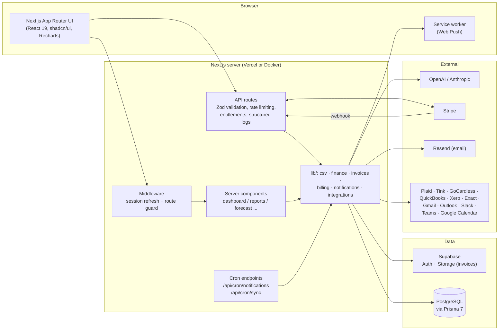

# FinPilot — AI Finance Copilot

A production-quality personal finance dashboard with an AI copilot, built with Next.js 15,
Supabase, Prisma and OpenAI/Anthropic.

## Features

- **Authentication** — email/password sign up with email confirmation, sign in, forgot/reset
  password (Supabase Auth, PKCE flow, session refresh middleware)
- **Dashboard** — current-month income/expense cards with month-over-month trends, total
  balance and savings rate, monthly cashflow chart (income/expense bars + net line),
  spending-by-category donut, largest expenses, cash-balance history (Recharts)
- **CSV bank statement import** — drag & drop upload; automatic detection of delimiter
  (comma/semicolon/tab/pipe), encoding (UTF-8/UTF-16/Windows-1252), US vs European number
  formats and date layouts; automatic column detection (date, description, amount or
  debit/credit pair, balance, counterparty) with a correctable mapping preview; duplicate
  rows are skipped across imports and every import is tracked as a batch that can be undone
- **Transactions** — server-side search (description/counterparty), filters (date range,
  category, type, amount range, import batch), pagination, inline category editing,
  multi-select bulk actions (set category, delete), manual add with validated forms
- **Categories** — per-user category set seeded on first login, user-defined categories with
  colors, and auto-categorization rules (description/counterparty pattern matching) applied
  during import
- **Invoice management** — drag & drop upload of PDF invoices, receipts and photos
  (JPG/PNG/WebP) stored in a private Supabase Storage bucket under a per-user path and served
  through short-lived signed URLs. AI extraction pulls vendor, invoice number, dates,
  currency, VAT, line items and totals (vision for images, text layer via `unpdf` for PDFs;
  strict-JSON prompt validated with Zod, one retry, graceful "needs review" fallback for
  scanned PDFs or failures). Every upload lands in an editable review form before saving.
  The `/invoices` dashboard shows status badges (draft/unpaid/paid/overdue), filters,
  outstanding/overdue/paid-this-month totals, due-soon reminders, a detail view with inline
  document preview and line items, quick mark paid/unpaid, and suggested transaction matches
  (amount + date + vendor similarity) with manual link/unlink — linking marks the invoice
  paid and the link shows on both sides.
- **Cash flow forecasting** — a deterministic forecast engine (`/forecast`) that combines
  recurring-payment scheduling, a linear spending trend and user-defined assumptions into
  30-day, 90-day and 12-month projections with an ~80% confidence band. Computes cash
  runway, net/gross burn rate, recurring income/expense totals and upcoming bills. Users can
  add what-if assumptions (one-off amounts on a date, monthly recurring adjustments with
  optional start/end dates, compounding % growth per month) and toggle them on/off — the
  forecast recomputes on every change. A streamed "Explain this forecast" action asks the AI
  for drivers, risks and recommendations.
- **AI Copilot** — a streaming financial assistant grounded in a rich snapshot of your data:
  12-month income/expense/net summaries, spending by category, top counterparties/suppliers,
  largest expenses, recurring payment patterns, the full cash forecast (runway, burn,
  projections, assumptions), and statistically unusual transactions (z-score vs category
  norms). Multiple conversations with auto-generated titles, rename/delete, markdown answers
  (tables, lists), data-driven suggested questions, and a stop-generation button. Works with
  both OpenAI and Anthropic through a shared streaming provider abstraction.
- **Executive reports** — a `/reports` area with a period selector (this month, last month,
  quarter, YTD, last 12 months, custom range) driving every figure: revenue, expenses, net
  profit and margin KPIs with period-over-period deltas, cash at period end, accounts
  receivable/payable, monthly trend combo chart, year-over-year comparison, income and
  expense category breakdowns, top vendors and customers, and AR/AP aging (current / 1–30 /
  31–60 / 60+ days). Invoices carry a payable/receivable direction toggle: AR is the sum of
  unpaid invoices you issued, AP the unpaid bills you owe. One-click exports: a professional
  PDF report (server-rendered with `pdf-lib` — no headless browser needed), a multi-sheet
  Excel workbook via `exceljs` (KPIs, monthly trends, transactions, categories, top
  vendors/customers) and CSV (transactions or monthly summary).
- **Notifications** — an in-app notification center (bell in the header with unread badge,
  mark read / mark all read) as the always-available channel, plus optional email (Resend)
  and Web Push (VAPID service worker) channels. AI-generated daily/weekly/monthly digests
  (what happened, notable changes, upcoming bills, forecast outlook — with a deterministic
  fallback when no AI key is set), large-transaction alerts (configurable threshold or
  statistically unusual expenses, evaluated immediately on create/import), low-cash warnings
  (balance below a configurable floor now, or projected to drop below it within N days using
  the forecast engine), and daily invoice reminders. Per-type and per-channel toggles live in
  Settings. An hourly Vercel Cron hits a CRON_SECRET-protected endpoint that evaluates all
  users idempotently via last-sent timestamps.
- **SaaS billing** — four plans (Free, Pro, Business, Enterprise) defined in a single source
  of truth (`src/lib/billing/plans.ts`) with per-plan limits (CSV imports and rows per
  import, AI messages, invoice extractions, exports, forecast assumptions). Stripe Checkout
  for upgrades, a webhook keeping the local subscription in sync, the Stripe Billing Portal
  for payment methods/cancellation, and a `/billing` page with the current plan, usage
  meters, plan matrix, invoice history and a referral program (share a link, earn +30 days
  of Pro per converted referral). Every new account gets a card-free 14-day Pro trial.
  Limits are enforced server-side in the API routes (friendly 402 responses with upgrade
  hints) and reflected in the UI (disabled export buttons, locked assumptions card, copilot
  quota banner). Without Stripe keys everything still works on Free/trial.
- **Admin & analytics** — an `isAdmin`-guarded `/admin` dashboard with user list
  (plan/usage/joined), KPI cards (total users, active subscriptions, MRR estimate, signups,
  AI usage) and charts driven by a lightweight internal `AnalyticsEvent` table (signup,
  import, AI message, export, upgrade — no third-party trackers).
- **Integrations** (Business plan) — an `/integrations` page connecting banks (Plaid via
  Link, Tink via OAuth, GoCardless Bank Account Data via requisitions — transactions flow
  through the same dedupe/categorization pipeline as CSV imports), accounting software
  (QuickBooks, Xero, Exact Online — bills and invoices upserted into the invoice module),
  mailboxes (Gmail, Outlook — PDF invoice attachments ingested into the extraction/review
  pipeline), chat (Slack, Teams — finance alerts and digests as extra notification
  channels) and Google Calendar (opt-in events for upcoming bills). OAuth tokens are
  encrypted at rest (AES-256-GCM), refreshed automatically, and every connection shows its
  status, last sync and last error with connect/disconnect/sync-now controls. An hourly
  cron runs due syncs with per-connection error isolation and failure backoff; providers
  without credentials simply show as "Not configured" with the env vars they need.
- **Profile & Settings** — display name, preferred currency, AI provider choice, theme
  (light/dark/system) and password change
- **UI** — responsive layout, dark mode, toast notifications, loading skeletons, error
  boundaries, shadcn/ui component library on Tailwind CSS v4

## Tech stack

| Layer      | Technology                                        |
| ---------- | ------------------------------------------------- |
| Framework  | Next.js 15 (App Router, React 19, TypeScript)     |
| Styling    | Tailwind CSS v4, shadcn/ui, next-themes           |
| Auth       | Supabase Auth (`@supabase/ssr`)                   |
| Database   | Supabase PostgreSQL via Prisma 7 (`adapter-pg`)   |
| Forms      | React Hook Form + Zod v4                          |
| Charts     | Recharts                                          |
| AI         | OpenAI / Anthropic via a small provider interface |
| Deployment | Vercel                                            |

## Project structure

```
├── prisma/
│   ├── schema.prisma          # Profile, Category, CategoryRule, ImportBatch,
│   │                          # Transaction, Budget, Conversation, ChatMessage,
│   │                          # Assumption, Invoice, InvoiceLineItem models
│   ├── migrations/            # SQL migrations (apply with npm run db:deploy)
│   └── seed.ts                # Demo data seeder
├── prisma.config.ts           # Prisma 7 CLI config (datasource, migrations, seed)
├── tests/                     # Vitest suite for the pure lib logic
├── .github/workflows/ci.yml   # Lint + typecheck + test + build pipeline
├── Dockerfile                 # Multi-stage image (Next.js standalone)
├── docker-compose.yml         # App + Postgres for self-hosting
├── src/
│   ├── app/
│   │   ├── (auth)/            # login, signup, forgot-password, reset-password
│   │   ├── (dashboard)/       # dashboard, transactions, import, categories,
│   │   │                      # invoices (+detail), forecast, copilot, profile,
│   │   │                      # settings
│   │   ├── api/               # transactions (+bulk), categories, rules,
│   │   │                      # import (parse/commit/batches), profile, copilot,
│   │   │                      # conversations, forecast (+explain), assumptions,
│   │   │                      # invoices (upload/document/matches/link/reminders)
│   │   ├── auth/              # Supabase callback + confirm handlers
│   │   ├── error.tsx          # global error boundary
│   │   └── not-found.tsx
│   ├── components/
│   │   ├── ui/                # shadcn/ui primitives (button, card, dialog, ...)
│   │   ├── auth/              # auth forms
│   │   ├── dashboard/         # sidebar, header, charts, stat cards
│   │   ├── transactions/      # table, toolbar (search/filters), add dialog
│   │   ├── import/            # dropzone, mapping wizard, import history
│   │   ├── categories/        # category + auto-categorization rule managers
│   │   ├── invoices/          # upload dialog, table, review form, document
│   │   │                      # preview, transaction matching
│   │   ├── forecast/          # forecast chart, assumptions manager, bills,
│   │   │                      # recurring tables, AI explanation
│   │   ├── copilot/           # chat interface
│   │   ├── profile/ settings/ # profile & settings forms
│   │   └── theme-*.tsx        # dark mode provider/toggle
│   ├── lib/
│   │   ├── ai/                # OpenAI/Anthropic streaming abstraction, financial
│   │   │                      # context snapshot, prompts, suggested questions
│   │   ├── csv/               # CSV decoding, delimiter/format/column detection,
│   │   │                      # row normalization (shared server + client)
│   │   ├── finance/           # shared recurrence detection + forecast engine
│   │   ├── invoices/          # AI extraction, PDF text, storage, matching,
│   │   │                      # reminders, serialization
│   │   ├── supabase/          # browser/server/middleware clients
│   │   ├── validations/       # Zod schemas
│   │   ├── categories.ts      # default category seeding + rule matching
│   │   ├── data.ts            # server-side data access & aggregation
│   │   ├── env.ts             # validated environment variables
│   │   ├── prisma.ts          # Prisma client singleton
│   │   └── utils.ts
│   ├── generated/prisma/      # generated Prisma client (git-ignored)
│   └── middleware.ts          # session refresh + route protection
└── .env.example
```

## Getting started

### 1. Install dependencies

```bash
npm install
```

### 2. Create a Supabase project

1. Create a project at [supabase.com](https://supabase.com).
2. In **Project Settings → API**, copy the project URL and anon key.
3. In **Project Settings → Database**, copy the pooled (port 6543) and direct (port 5432)
   connection strings.
4. Optional: in **Authentication → URL Configuration**, set the site URL and add
   `http://localhost:3000/auth/callback` to the redirect allow list.

### 3. Configure environment variables

```bash
cp .env.example .env
```

Fill in the Supabase values and at least one AI provider key (`OPENAI_API_KEY` or
`ANTHROPIC_API_KEY`).

### 4. Create the database schema

```bash
npm run db:deploy      # applies prisma/migrations (or: npm run db:push)
```

### 5. Create the invoice storage bucket

Invoice documents live in a **private** Supabase Storage bucket named `invoices`, with
files under a per-user prefix (`<userId>/<invoiceId>/<filename>`). In the Supabase
dashboard:

1. **Storage → New bucket** — name it `invoices`, keep **Public bucket** off, and
   (optionally) set a 10 MB file size limit with allowed MIME types `application/pdf`,
   `image/jpeg`, `image/png`, `image/webp`.
2. Add RLS policies so each user can only touch their own folder. In **SQL Editor** run:

```sql
create policy "Users manage own invoice files"
on storage.objects for all to authenticated
using (
  bucket_id = 'invoices'
  and (storage.foldername(name))[1] = auth.uid()::text
)
with check (
  bucket_id = 'invoices'
  and (storage.foldername(name))[1] = auth.uid()::text
);
```

The app uploads with the user's own session (no service key needed) and views/downloads
go through short-lived signed URLs from `GET /api/invoices/[id]/document`.

### 6. Run the app

```bash
npm run dev
```

Open [http://localhost:3000](http://localhost:3000), create an account (confirm the email),
and start adding transactions.

### Optional: seed demo data

After signing up, grab your user id (Supabase dashboard → Authentication → Users) and run:

```bash
npm run db:seed -- <supabase-user-id> <email>
```

### Optional: notification channels

In-app notifications (the bell in the header) work out of the box. Email and push are
enabled by env vars — when they are missing, those sends are logged and skipped.

**Email (Resend)** — create an API key at [resend.com](https://resend.com), verify your
sending domain, and set:

```bash
RESEND_API_KEY="re_..."
EMAIL_FROM="FinPilot <notifications@yourdomain.com>"
NEXT_PUBLIC_APP_URL="https://yourapp.vercel.app"   # used for links in emails
```

**Web Push (VAPID)** — generate a key pair once and put it in the env:

```bash
npx web-push generate-vapid-keys
```

```bash
NEXT_PUBLIC_VAPID_PUBLIC_KEY="<publicKey>"
VAPID_PRIVATE_KEY="<privateKey>"
VAPID_SUBJECT="mailto:you@yourdomain.com"
```

Then enable the push channel in **Settings → Notifications** and click
*Enable on this device* (registers `public/sw.js` and stores the browser's subscription).

**Scheduling** — summaries and recurring alerts are evaluated by
`GET /api/cron/notifications`, protected by a bearer token:

```bash
CRON_SECRET="<any long random string>"
```

In production, Vercel Cron drives it hourly via `vercel.json` (Vercel automatically sends
`Authorization: Bearer $CRON_SECRET` for cron invocations). Locally you can trigger a run
with:

```bash
curl -H "Authorization: Bearer $CRON_SECRET" http://localhost:3000/api/cron/notifications
```

### Optional: billing (Stripe)

Without Stripe keys the app runs fully on the Free plan (every new account still gets the
local 14-day Pro trial) and `/billing` shows a "billing not configured" notice. To enable
paid plans:

1. **Create the products/prices** — in the [Stripe dashboard](https://dashboard.stripe.com)
   create two products, *FinPilot Pro* and *FinPilot Business*, each with a monthly
   recurring price ($19 and $49 to match `src/lib/billing/plans.ts`, or adjust the file).
   Copy the two `price_...` ids.
2. **Configure the webhook** — add an endpoint pointing at
   `https://yourapp.vercel.app/api/webhooks/stripe` subscribed to:
   `checkout.session.completed`, `customer.subscription.created`,
   `customer.subscription.updated`, `customer.subscription.deleted`, `invoice.paid`,
   `invoice.payment_failed`. Copy its signing secret. (Locally, use
   `stripe listen --forward-to localhost:3000/api/webhooks/stripe`.)
3. **Enable the Billing Portal** — in **Settings → Billing → Customer portal**, activate the
   portal and allow plan switching/cancellation. The app's *Manage billing* button opens it.
4. **Set the env vars**:

```bash
STRIPE_SECRET_KEY="sk_live_..."        # or sk_test_...
STRIPE_WEBHOOK_SECRET="whsec_..."
STRIPE_PRICE_PRO="price_..."
STRIPE_PRICE_BUSINESS="price_..."
```

Enterprise is contact-sales only (no checkout). Upgrades run through Stripe Checkout with a
card-backed trial applied only if the user's local trial is still running.

**Admin access** — the `/admin` dashboard is enabled per user by a manual database flag:

```sql
UPDATE profiles SET is_admin = true WHERE email = 'you@yourdomain.com';
```

### Optional: integrations (Business plan)

The `/integrations` page connects banks (Plaid, Tink, GoCardless), accounting software
(QuickBooks, Xero, Exact Online) and productivity tools (Gmail, Outlook, Slack, Teams,
Google Calendar). Everything is optional: a provider's card shows **Not configured** with
its required env vars until they are set. Two shared prerequisites:

```bash
# Encrypts OAuth tokens at rest (AES-256-GCM). Required for all integrations.
INTEGRATION_ENCRYPTION_KEY="$(openssl rand -hex 32)"
# Only for Gmail/Outlook invoice ingestion (background storage uploads).
SUPABASE_SERVICE_ROLE_KEY="..."
```

For every OAuth provider, register `https://yourapp.vercel.app/api/integrations/<id>/callback`
as the redirect URI (`<id>` = `tink`, `quickbooks`, `xero`, `exact`, `gmail`, `outlook`,
`slack`, `google-calendar`). App registration in brief:

| Provider | Where | Notes |
| --- | --- | --- |
| Plaid | [dashboard.plaid.com](https://dashboard.plaid.com) | Copy client id + secret; `PLAID_ENV=sandbox` to start. Uses Plaid Link, no redirect URI needed. |
| Tink | [console.tink.com](https://console.tink.com) | Create an app, add the redirect URI, set `TINK_MARKET`. |
| GoCardless | [bankaccountdata.gocardless.com](https://bankaccountdata.gocardless.com) | Create *user secrets* (`GOCARDLESS_SECRET_ID`/`_KEY`). Uses requisitions, not OAuth; set `GOCARDLESS_INSTITUTION_ID` or pass `?institution=` when connecting. |
| QuickBooks | [developer.intuit.com](https://developer.intuit.com) | App with the *Accounting* scope; add the redirect URI. `QUICKBOOKS_ENV=sandbox` for test companies. |
| Xero | [developer.xero.com](https://developer.xero.com) | Web app; scopes `offline_access accounting.transactions.read accounting.contacts.read`. |
| Exact Online | [apps.exactonline.com](https://apps.exactonline.com) | Register an app in your region and set `EXACT_REGION` (e.g. `start.exactonline.nl`). |
| Google (Gmail + Calendar) | [console.cloud.google.com](https://console.cloud.google.com) | One OAuth client for both providers; enable the Gmail and Calendar APIs; scopes `gmail.readonly` and `calendar.events`. |
| Microsoft (Outlook) | [portal.azure.com](https://portal.azure.com) | Entra app registration, delegated `Mail.Read` + `offline_access`; web redirect URI. |
| Slack | [api.slack.com/apps](https://api.slack.com/apps) | App with the `incoming-webhook` scope; the user picks a channel during install. |
| Teams | — | No app needed: paste a channel *incoming webhook* URL on the integrations page. |

How syncing works: Vercel Cron hits `GET /api/cron/sync` hourly (same `CRON_SECRET` bearer
token as notifications). Each connection syncs when its interval has elapsed (6 h for
banks/accounting/email, 24 h for calendar), with per-connection error isolation and
exponential backoff after failures. Bank transactions run through the same dedupe +
auto-categorization pipeline as CSV imports (one undoable import batch per sync); accounting
invoices upsert by `external_ref`; Gmail/Outlook PDF attachments flow through the invoice
extraction pipeline into the review queue; Slack/Teams act as additional notification
channels; Google Calendar events for upcoming bills are opt-in via a toggle on the card.

## Scripts

| Script               | Purpose                                  |
| -------------------- | ---------------------------------------- |
| `npm run dev`        | Start the dev server (Turbopack)         |
| `npm run build`      | Production build                         |
| `npm run start`      | Serve the production build               |
| `npm run lint`       | Run ESLint                               |
| `npm run typecheck`  | TypeScript `tsc --noEmit`                |
| `npm test`           | Run the Vitest suite once                |
| `npm run test:watch` | Run Vitest in watch mode                 |
| `npm run db:push`    | Push the Prisma schema to the database   |
| `npm run db:migrate` | Create/apply a development migration     |
| `npm run db:deploy`  | Apply migrations in production           |
| `npm run db:seed`    | Seed demo transactions for a user        |
| `npm run db:studio`  | Open Prisma Studio                       |

## Architecture



## Environment variables

Every variable is optional unless marked required — features degrade gracefully when their
keys are missing. Full commented reference in [.env.example](.env.example).

| Variable | Required | Used for |
| --- | --- | --- |
| `NEXT_PUBLIC_SUPABASE_URL` | ✅ | Supabase project URL (auth + storage) |
| `NEXT_PUBLIC_SUPABASE_ANON_KEY` | ✅ | Supabase anon key (safe for the client) |
| `DATABASE_URL` | ✅ | Pooled Postgres connection (runtime) |
| `DIRECT_URL` | ✅ | Direct Postgres connection (migrations) |
| `NEXT_PUBLIC_APP_URL` | ✅ in prod | Absolute app URL (emails, OAuth redirects, SEO) |
| `AI_PROVIDER`, `OPENAI_API_KEY`, `OPENAI_MODEL`, `ANTHROPIC_API_KEY`, `ANTHROPIC_MODEL` | — | AI copilot, forecast explanations, invoice extraction, digests |
| `RESEND_API_KEY`, `EMAIL_FROM` | — | Email notification channel |
| `NEXT_PUBLIC_VAPID_PUBLIC_KEY`, `VAPID_PRIVATE_KEY`, `VAPID_SUBJECT` | — | Web Push channel |
| `CRON_SECRET` | ✅ in prod | Bearer token for both cron endpoints |
| `UPSTASH_REDIS_REST_URL`, `UPSTASH_REDIS_REST_TOKEN` | — | Shared rate limiting for multi-instance deployments |
| `STRIPE_SECRET_KEY`, `STRIPE_WEBHOOK_SECRET`, `STRIPE_PRICE_PRO`, `STRIPE_PRICE_BUSINESS` | — | Paid plans, webhook sync, billing portal |
| `INTEGRATION_ENCRYPTION_KEY` | for integrations | AES-256-GCM token encryption (`openssl rand -hex 32`) |
| `SUPABASE_SERVICE_ROLE_KEY` | for mail ingestion | Background storage uploads (Gmail/Outlook) — server-only, never expose |
| `PLAID_*`, `TINK_*`, `GOCARDLESS_*`, `QUICKBOOKS_*`, `XERO_*`, `EXACT_*`, `GOOGLE_*`, `MICROSOFT_*`, `SLACK_*` | per provider | Integration credentials (see the integrations section) |

Only `NEXT_PUBLIC_*` values reach the browser bundle: the Supabase URL + anon key (designed
to be public), the app URL and the VAPID *public* key. Everything else is server-only.

## Security

- **Auth & ownership** — `src/middleware.ts` guards all app routes; every API route
  re-checks `supabase.auth.getUser()` and scopes each query/mutation by the authenticated
  user id (deletes/updates use `deleteMany`/ownership pre-checks so a foreign id yields 404).
- **Security headers** — set globally in `next.config.ts`: a CSP restricted to self plus
  Supabase/Plaid origins, HSTS (2 years, preload-ready), `X-Frame-Options: DENY`,
  `X-Content-Type-Options: nosniff`, `Referrer-Policy: strict-origin-when-cross-origin`
  and a restrictive `Permissions-Policy`.
- **Rate limiting** — `src/lib/rate-limit.ts` applies a token bucket per user to the
  expensive endpoints (AI chat/explanations, CSV parse/commit, invoice upload, report
  exports, billing sessions, manual syncs) returning 429 + `Retry-After`. In-memory by
  default (single instance); set the Upstash env vars to share limits across instances.
  Login/signup attempts hit Supabase Auth directly, which applies its own rate limits.
- **Upload limits** — CSV imports are capped at 8 MB / 20k rows, invoice documents at
  10 MB, with plan-based row caps on top.
- **Webhooks** — Stripe events are verified with `constructEventAsync` against
  `STRIPE_WEBHOOK_SECRET`; cron endpoints require the `CRON_SECRET` bearer token.
- **Secrets at rest** — integration OAuth tokens are AES-256-GCM encrypted with
  `INTEGRATION_ENCRYPTION_KEY`; documents live in a private bucket behind signed URLs.
- **Row Level Security** — the app's own Postgres access goes through Prisma's *direct*
  connection, which uses the `postgres` role and therefore **bypasses RLS**; isolation is
  enforced in the API layer as described above. RLS still matters for everything that
  talks to Supabase with the anon key: keep RLS **enabled** on all tables in the `public`
  schema (Supabase's default) with no anon policies, so the Data API cannot read app
  tables, and keep the storage policies from the setup section so users can only touch
  their own invoice files. If you add Supabase client-side database access later, write
  policies per table (`user_id = auth.uid()`).

## Monitoring & logging

- `src/lib/logger.ts` emits one JSON line per event (`level`, `time`, `msg`, plus fields
  like `route`, `userId`, `durationMs`, serialized `error`) from every API route, cron job
  and background lib — parseable by Vercel Log Drains, Datadog, Loki, CloudWatch, etc.
- `GET /api/health` checks database connectivity and returns `200 {status:"ok"}` or a 503 —
  point your uptime monitor or container healthcheck at it.
- Error boundaries: `src/app/error.tsx` (route errors) and `src/app/global-error.tsx`
  (root-layout errors) log the error digest, which correlates with the server-side log line.
- **Sentry (optional)** — `@sentry/nextjs` is not bundled (keeps the corporate-registry
  install lean). To wire it: `npm install @sentry/nextjs`, run `npx @sentry/wizard@latest -i nextjs`
  (creates `sentry.*.config.ts` + `instrumentation.ts`), and set `SENTRY_DSN` /
  `NEXT_PUBLIC_SENTRY_DSN` in the env. The error boundaries and structured logs work with
  or without it.

## Testing

```bash
npm test          # run everything once
npm run test:watch
```

The Vitest suite (`tests/`, 69 tests) covers the pure logic: CSV parsing/encoding/column
detection, import dedupe fingerprints, the forecast engine (recurrence detection, trend +
scheduling, assumptions, runway), entitlements and plan-gating math, report period
resolution, CSV/Excel/PDF export generation, notification scheduling idempotency, the
AES-256-GCM round-trip and the rate limiter. `server-only` is aliased out in
`vitest.config.ts` so lib modules import cleanly under Node.

## CI

`.github/workflows/ci.yml` runs install → lint → typecheck → test → build on pushes and
PRs. The build uses dummy `DATABASE_URL`/`NEXT_PUBLIC_APP_URL` values (no live services
needed). No repository secrets are required for CI itself; runners behind a corporate
proxy need an `.npmrc` pointing at the internal npm mirror.

## Docker

```bash
cp .env.example .env        # fill in Supabase + app values
docker compose up -d --build
docker compose exec app npx prisma migrate deploy   # once, applies migrations
```

`Dockerfile` is a multi-stage build on Next.js standalone output (small runtime image, no
dev dependencies, non-root user); `docker-compose.yml` bundles a Postgres 16 instance and
points `DATABASE_URL` at it. Auth and invoice storage still come from your Supabase
project. Building the image outside a corporate network works against the public npm
registry; inside one, copy your `.npmrc` + CA into the build stage.

See **[DEPLOYMENT.md](DEPLOYMENT.md)** for the step-by-step Vercel and self-hosted guides,
and **[PRODUCTION_CHECKLIST.md](PRODUCTION_CHECKLIST.md)** before going live.

## Deploying to Vercel

1. Push this repository to GitHub/GitLab and import it in Vercel.
2. Add all variables from `.env.example` in **Project → Settings → Environment Variables**.
3. Deploy. The build runs `prisma generate` automatically (postinstall) before `next build`.
4. Add your production URL (e.g. `https://yourapp.vercel.app/auth/callback`) to the Supabase
   auth redirect allow list, and set it as the site URL.

## Architecture notes

- **Auth**: `src/middleware.ts` refreshes the Supabase session on every request and guards
  `/dashboard`, `/transactions`, `/copilot`, `/profile` and `/settings`. Server components
  re-check the user via `supabase.auth.getUser()`.
- **Profiles**: a `profiles` row (same UUID as the Supabase auth user) is upserted on first
  authenticated visit, so no database trigger is required.
- **AI abstraction**: `src/lib/ai` exposes a tiny `AiClient` interface (`chat` +
  `chatStream`) with `openai` and `anthropic` implementations over plain `fetch` and a
  shared SSE parser; `getAiClient()` picks the user's preferred provider and falls back to
  whichever has an API key.
- **Copilot pipeline**: `src/lib/ai/context.ts` assembles a token-efficient financial
  snapshot (balance, 12-month summaries, category/supplier spend, recurring patterns,
  the full forecast with runway/burn/assumptions, z-score anomalies) that
  `src/lib/ai/prompts.ts` injects into the system prompt. `/api/copilot` streams the reply
  to the client as newline-delimited JSON events (`meta` → `delta`* → `done`/`error`); the
  user message is persisted before streaming and the assistant message after (partial
  output is kept if the user hits stop).
- **Forecast engine**: `src/lib/finance/recurrence.ts` groups transactions by normalized
  merchant and keeps groups with a stable amount (CV < 0.35) and a consistent interval
  (weekly/biweekly/monthly/quarterly). `src/lib/finance/forecast.ts` schedules each
  recurring item forward at its cadence, projects the non-recurring remainder with a
  least-squares trend over the last six full months (recurring equivalents subtracted,
  clamped at zero, spread across the days of each month), then applies user assumptions:
  one-offs on their date, monthly adjustments on their day-of-month within their window,
  and % growth compounding monthly on the organic flows of its side. The confidence band is
  ±1.28σ of historical monthly net, widening with √time. Daily granularity feeds the
  30/90-day charts and month-end sampling the 12-month chart; runway is the first projected
  zero-crossing (extrapolated past the simulation if still trending down, `null` = infinite).
  Everything is recomputed from current data on each request — assumption or transaction
  changes are reflected immediately. The engine is covered by `tests/forecast.test.ts`.
- **Data isolation**: every query and mutation is scoped to the authenticated user id in the
  API routes; the AI copilot only ever sees the requesting user's aggregated data.
- **CSV import**: `/api/import/parse` analyzes the upload (delimiter, encoding, number/date
  formats, column roles) and returns a suggested mapping with a preview; the client lets the
  user correct the mapping (re-normalizing samples locally with the same shared `lib/csv`
  code) and then re-uploads the file with the confirmed mapping to `/api/import/commit`.
  Each imported row gets a SHA-256 fingerprint (date, type, amount, description,
  counterparty, in-file occurrence index) that is unique per user, so re-importing the same
  statement skips duplicates. Deleting an `ImportBatch` cascades to its transactions, which
  is how undo works. The parser and fingerprints are covered by `tests/csv.test.ts` and
  `tests/fingerprint.test.ts`.
- **Categorization**: categories are per-user rows (seeded defaults on first login);
  `CategoryRule` patterns are matched case-insensitively against description + counterparty
  at import time, longest pattern first. Deleting a category sets its transactions to
  uncategorized (FK `ON DELETE SET NULL`).
- **Invoice extraction**: `POST /api/invoices/upload` stores the original document first,
  then extracts — images go to the provider's vision capability through the shared
  `AiClient` (multimodal content parts work with both OpenAI and Anthropic), PDFs get
  their text layer read with `unpdf` and sent as text. The model must answer with strict
  JSON validated by Zod (`src/lib/invoices/extraction.ts`); one retry on invalid output,
  and any failure (scanned PDF without a text layer, provider errors, bad JSON) creates
  the invoice as `NEEDS_REVIEW` with empty fields for manual entry — the document stays
  attached either way. Saving the review form moves a DRAFT invoice to UNPAID; "overdue"
  is always derived from due date + unpaid status, never stored.
- **Invoice ↔ transaction matching**: `src/lib/invoices/match.ts` scores expense
  transactions by amount closeness (hard gate: within 3% or one currency unit), proximity
  to the invoice/due date and vendor-vs-counterparty token similarity. Linking is manual
  (one click on a suggestion) and marks the invoice paid; unlinking reverts it to unpaid.
  `GET /api/invoices/reminders` returns due-soon (7 days) and overdue invoices — the same
  data feeds the invoices page cards, the main dashboard banner and the invoice-reminder
  notifications.
- **Notifications**: one event fans out through `src/lib/notifications/dispatch.ts` to the
  channels the user enabled — an in-app `Notification` row (the always-works channel behind
  the header bell), an HTML email via Resend's REST API (plain `fetch`, digest and alert
  templates in `src/lib/notifications/email.ts`), and Web Push via `web-push` with dead
  subscriptions pruned on 404/410. `GET /api/cron/notifications` (hourly Vercel Cron,
  CRON_SECRET bearer) walks all users and sends due daily/weekly (Mondays)/monthly (the
  1st) AI digests plus low-cash and invoice-reminder alerts; last-sent timestamps on
  `NotificationPreference` are claimed *before* dispatch, making re-runs idempotent.
  Large-transaction alerts don't wait for cron: they are evaluated inline on manual create
  and CSV import (threshold from preferences, or expenses above mean + 3σ of the last 90
  days; multiple hits in one import are aggregated into a single notification). Digests are
  written by the user's AI provider from the copilot snapshot + forecast, with a
  deterministic text fallback so summaries still send without an AI key.
- **Billing & entitlements**: `src/lib/billing/plans.ts` is the single source of truth for
  plans/limits; `getEntitlements(userId)` (in `entitlements.ts`) resolves the effective plan
  (paid Stripe plan → local trial → Free) and returns it with this month's `UsageRecord`
  counters. Gated routes call `checkLimit`/`upgradeError` and return 402 JSON with an
  upgrade hint; usage counters are per calendar month (`YYYY-MM`) and increment atomically
  via upsert. The Stripe integration uses the official `stripe` package: Checkout Sessions
  carry the `userId` in metadata, and `/api/webhooks/stripe` verifies signatures and syncs
  plan, status, period end and cancel-at-period-end onto the local `Subscription` row
  (price id → plan via the env-configured price ids). The 14-day Pro trial is purely local
  (`trialEndsAt` set when the subscription row is first created) so it needs no card and no
  Stripe account.
- **Referrals**: each profile gets a collision-safe 8-character code on first billing-page
  visit. `/signup?ref=CODE` stores the code in Supabase signup metadata; the first
  authenticated visit creates the `Referral` row (self-referrals ignored). When the referred
  user completes a paid checkout, the webhook marks the referral converted exactly once and
  extends the referrer's `trialEndsAt` by 30 days.
- **Admin & analytics**: `trackEvent()` writes fire-and-forget rows to `analytics_events`
  (signup, import, ai_message, export, upgrade, invoice_upload, referral events). `/admin`
  (server-guarded by `profiles.is_admin`, plus admin-only `GET /api/admin/stats` and
  `GET /api/admin/users`) shows KPIs, a signups-per-day chart, top events and the user list
  with per-user plan and monthly usage. MRR is estimated from plan list prices of active
  paid subscriptions.
- **Integrations framework**: `src/lib/integrations/registry.ts` declares every provider
  (category, capabilities, flow, required env vars, OAuth endpoints); the connect, callback,
  disconnect, sync, options and webhook API routes are fully generic and dispatch to
  per-provider hooks (`src/lib/integrations/providers/*`) for the non-uniform parts
  (QuickBooks realmId, Xero tenant discovery, Slack's incoming-webhook payload, GoCardless
  requisitions, Plaid Link). Tokens are AES-256-GCM encrypted at rest
  (`INTEGRATION_ENCRYPTION_KEY`); refresh happens transparently before each sync and a
  failed refresh flips the connection to EXPIRED with a reconnect prompt in the UI. Every
  sync attempt is recorded as a `SyncRun` (stats JSON or error); the hourly
  `GET /api/cron/sync` runs due connections with per-connection isolation and doubles the
  retry interval per consecutive failure (capped at 16×). Bank pulls reuse the CSV import
  pipeline with provider transaction ids as dedupe fingerprints; accounting invoices upsert
  on `invoices.external_ref`; mailbox PDFs are stored via the Supabase service-role client
  and flow through the standard extraction/review pipeline; Slack/Teams are extra fan-out
  channels in the notification dispatcher (being connected is the opt-in). The whole
  feature is gated to Business+ plans via entitlements.
